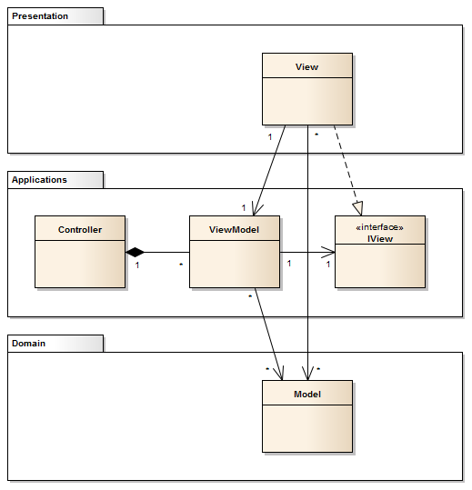

This article provides information about the source code and internal organization of TumblThree. It is recommended to start here if you want to contribute to the project.

## High level overview

TumblThree is a Tumblr and Twitter blog backup application, which downloads photo, video, audio and text posts from a given tumblr/twitter blog. It is the code rewrite of [TumblTwo](https://github.com/johanneszab/TumblTwo), using the [Win Application Framework (WAF)](https://github.com/jbe2277/waf) and C# with [WPF](https://docs.microsoft.com/en-us/visualstudio/designers/getting-started-with-wpf) and the [MVVM pattern](https://github.com/jbe2277/waf/wiki/Model-View-ViewModel-Pattern#3-structure).

## Projects and their role

Below is a short summary of the TumblThree.sln projects going from low to high level of the layered architecture.

- RateLimiter: A C# port of Google's Guava [RateLimiter](https://github.com/sergii-sakharov/Guava.RateLimiter).
- WpfApplicationFramework: The [Win Application Framework (WAF)](https://github.com/jbe2277/waf) is a lightweight Framework that helps you to create well-structured XAML Applications in WPF. It supports you in applying various architectural patterns:
  - [Layered Architecture](https://github.com/jbe2277/waf/wiki/Layered-Architecture)
  - [Modular Architecture](https://github.com/jbe2277/waf/wiki/Modular-Architecture)
  - [Model-View-ViewModel pattern](https://github.com/jbe2277/waf/wiki/Model-View-ViewModel-Pattern)
- TumblThree.Domain: The Domain Layer holding the data models and base classes.
- TumblThree.Applications: The Application Layer containing the business logic of TumblThree.
- TumblThree.Presentation: The Presentation Layer (GUI) part of TumblThree.

### RateLimiter / WpfApplicationFramework

RateLimiter and WpfApplicationFramework are two libraries which are used by TumblThree. The former supports implementing a rate limiter that limits the amount of requests against the servers and its throughput and the other helps in creating a well-structured XAML Applications in WPF. We mainly use the architecture patterns and a few of its base classes.

### TumblThree.Domain

This project contains the most basic data models and some common base classes used in the higher layers. It belongs to the [domain layer](https://github.com/jbe2277/waf/wiki/Layered-Architecture#6-domain-layer).

### TumblThree.Applications

The business logic ([application layer](https://github.com/jbe2277/waf/wiki/Layered-Architecture#5-application-layer)) of TumblThree resides here. It holds the crawler, parser and downloader classes, higher-level data models, service classes and the GUI-related controllers, view models and view interfaces from the [MVVM pattern](https://github.com/jbe2277/waf/wiki/Model-View-ViewModel-Pattern#3-structure).

[jbe2277]

### TumblThree.Presentation

This project contains the GUI related things ([presentation layer](https://github.com/jbe2277/waf/wiki/Layered-Architecture#4-presentation-layer)). It holds the views ([MVVM pattern](https://github.com/jbe2277/waf/wiki/Model-View-ViewModel-Pattern#3-structure)) as well as everything specifically platform related. Currently only Windows is supported. In theory, it should be possible to exchange this layer to make the application available on another operating system.
  

<ins>**References**</ins>
- **jbe2277**. jbe2277, Win Application Framework (WAF), 🌍[https://github.com/jbe2277/waf](https://github.com/jbe2277/waf)
