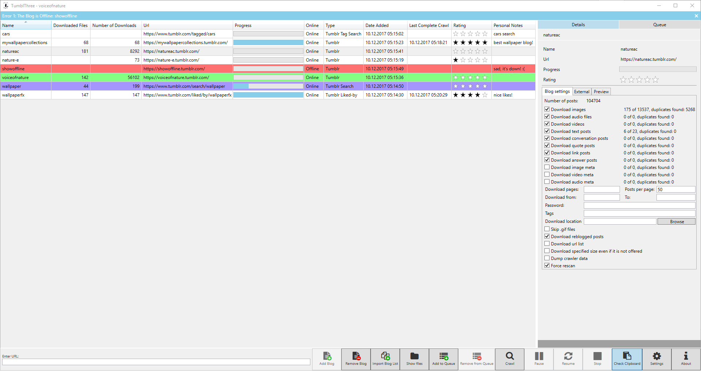

# TumblThree - A Tumblr Blog Backup Application

TumblThree is the code rewrite of [TumblTwo](https://github.com/johanneszab/TumblTwo), a free and open source Tumblr blog backup application, using C# with WPF and the MVVM pattern. It uses the [Win Application Framework (WAF)](https://github.com/jbe2277/waf). It downloads photo, video, audio and text posts from a given tumblr blog.

## Features:

* Source code at github (Written in C# using WPF and MVVM).
* Multiple concurrent downloads of a single blog.
* Multiple concurrent downloads of different blogs.
* Internationalization support (currently available: zh, ru, de, fr, es).
* A download queue.
* Autosave of the queuelist.
* Save, clear and restore the queuelist.
* A clipboard monitor that detects *http(s):// .tumblr.com* urls in the clipboard (copy and paste) and automatically adds the blog to the bloglist.
* A settings panel (change download location, turn preview off/on, define number of concurrent downloads, set the imagesize of downloaded pictures, set download defaults, enable portable mode, etc.).
* Allows to set a http proxy.
* A bandwidth throttler.
* An option to download an url list instead of the actual files.
* Set a start time for a automatic download (e.g. during nights).
* An option to skip the download of a file if it has already been downloaded before in any currently added blog.
* Uses SSL connections.
* Preview of photos & videos.
* Taskbar buttons and key bindings.

### Blog backup/download:

* Download of photo, video (only tumblr.com hosted), text, audio, quote, conversation, link and question posts.
* Download meta information for photo, video and audio posts.
* Downloads inlined photos and videos (e.g. photos embedded in question&answer posts).
* Download of all image sizes possible (SVC, API only for newer blogs, higher resolution not possible for old blogs *1).
* Support for downloading Imgur.com, Gfycat.com and Webmshare.com linked files in tumblr posts.
* Download of safe mode/NSFW blogs.
* Allows to download only original content of the blog and skip reblogged posts.
* Can download only tagged posts.
* Can download only specific blog pages instead of the whole blog.
* Allows to download blog posts in a defined time span.
* Can download hidden blogs (login required / dash board blogs).
* Can download password protected blogs (of non-hidden blogs).

### Liked/by backup/download:

* A downloader for downloading "liked by" photos and videos instead of a tumblr blog (e.g. https://www.tumblr.com/liked/by/wallpaperfx/) (login required).
* Download of all image sizes possible (SVC, API only for newer blogs, higher resolution not possible for old blogs *1).
* Allows to download posts in a defined time span. 

### Tumblr search backup/download:

* A downloader for downloading photos and videos from the tumblr search (e.g. http://www.tumblr.com/search/my+keywords).
* Download of all image sizes possible (SVC, API only for newer blogs, higher resolution not possible for old blogs *1).

### Tumblr tag search backup/download:

* A downloader for downloading photos and videos from the tumblr tag search (e.g. http://www.tumblr.com/tagged/my+keywords) (login required).
* Download of all image sizes possible (SVC, API only for newer blogs, higher resolution not possible for old blogs *1).
* Allows to download posts in a defined time span.

_*1 [Tumblr raw image files are inaccessible as of August 10, 2018](https://github.com/johanneszab/TumblThree/issues/261)_

## Download:

Latest releases can be found [here](https://github.com/TumblThreeApp/TumblThree/releases).

## Screenshot:

